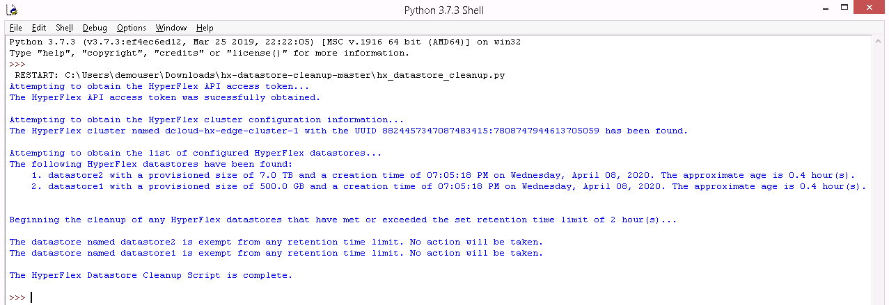
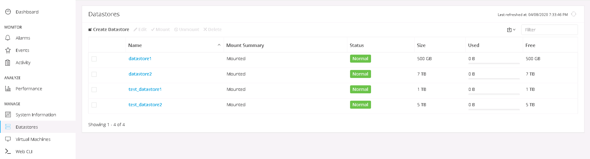
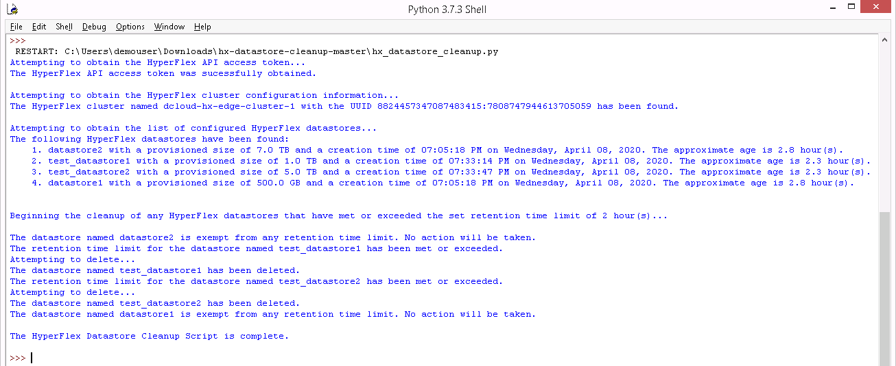

# Cisco HyperFlex Datastore Cleanup

[](https://developer.cisco.com/codeexchange/github/repo/ugo-emekauwa/hx-datastore-cleanup)

Cisco HyperFlex Datastore Cleanup for Cisco HyperFlex utilizes the HyperFlex API to automatically delete any datastores that have met or exceeded a specified retention time limit. The ability to exempt any datastores from the retention time limit is provided.

This tool is intended for use on Cisco HyperFlex systems in demonstration or training environments. Do not use on production systems.

## Prerequisites:
1. Python 3 installed, which can be downloaded from [https://www.python.org/downloads/](https://www.python.org/downloads/).
2. Clone or download the Cisco HyperFlex Datastore Cleanup repository by using the  link on the main repository web page or by running the following command:
    ```
    git clone https://github.com/ugo-emekauwa/hx-datastore-cleanup
    ```
3. Install the required Python modules **requests** and **urllib3**. The requirements.txt file in the repository can be used by running the following command:
    ```
    python -m pip install -r requirements.txt
    ```
4. The IP address of the targeted Cisco HyperFlex system.
5. User credentials with administrative rights on the targeted Cisco HyperFlex system.
6. [_Optional_] The names of any datastores on the targeted Cisco HyperFlex system which will be exempt from any retention time limit.


## Getting Started:
1. Please ensure that the above prerequisites have been met.
2. Open the **hx_datastore_cleanup.py** file in an IDE or text editor.
3. Go to the comment section named **Required Variables**, as shown below:
    ```python
    ######################
    # Required Variables #
    ######################
    ```
4. Set the value of the variable named `hx_admin` with the username of the credentials that will be used to access the targeted Cisco HyperFlex system. The value must be a string. For example, here is an entry that sets the username to **admin**:
    ```python
    hx_admin = "admin"
    ```
5. Set the value of the variable named `hx_password` with the password of the credentials that will be used to access the targeted Cisco HyperFlex system. The value must be a string. For example, here is an entry that sets the password to **C1sco12345**:
    ```python
    hx_password = "C1sco12345"
    ```
6. Set the value of the variable named `hx_connect_ip` with the IP address of the targeted Cisco HyperFlex system. The value must be a string. For example, here is an entry that sets the IP address to **192.168.1.100**:
    ```python
    hx_connect_ip = "192.168.1.100"
    ```
7. Set the value of the variable named `hx_datastore_retention_time_limit_hours` with the maximum number of hours that a newly created or pre-existing datastore can be retained on the Cisco HyperFlex system before deletion. The value must be an integer. For example, here is an entry that sets the retention time limit to **24** hours:
    ```python
    hx_datastore_retention_time_limit_hours = 24
    ```
8. [_Optional_] Set the value of the variable named `hx_exempted_datastores_list` by providing the names of any datastores that will be exempt from the retention time limit. The values must be strings separated by commas within the parentheses of the provided empty tuple `()`. For example, here is a sample entry that exempts three datastores from the retention time limit:
    ```python
    hx_exempted_datastores_list = ("datastore1", "datastore2", "datastore3")
    ```
    Here is another example with a sample entry that exempts one datastore from the retention time limit: 
    ```python
    hx_exempted_datastores_list = ("datastore1")
    ```
9. Save the **hx_datastore_cleanup.py** file. The file is now ready for use.

## How to Use (w/ Examples):

1. After fulfilling the requirements listed in the [**Prerequisites**](https://github.com/ugo-emekauwa/hx-datastore-cleanup#prerequisites) and [**Getting Started**](https://github.com/ugo-emekauwa/hx-datastore-cleanup#getting-started) sections, run **hx_datastore_cleanup.py** directly from your IDE or from the command line e.g.:
    ```
    python hx_datastore_cleanup.py
    ```
2. Here is an example of the output from **hx_datastore_cleanup.py** in which the datastores named datastore1 and datastore2 on the targeted HyperFlex cluster are exempt and no other datastores are present.

    

    All of the available datastores on the targeted HyperFlex cluster are listed with information regarding the size, creation time and age. The datastore retention time limit set is 2 hours. No datastores need to be cleaned up at this time. The exemption of datastore1 and datastore2 is accomplished with the following entries in hx_exempted_datastores_list:
    ```python
    hx_exempted_datastores_list = ("datastore1", "datastore2")
    ```

3. To test **hx_datastore_cleanup.py**, here two test datastores named test_datastore1 and test_datastore2 have been created in HX Connect on a targeted HyperFlex cluster.

    

4. After waiting over 2 hours for the datastore retention time limit to be met or exceeded, here is an example of the output after re-running **hx_datastore_cleanup.py**.

    

    As the above screenshot shows, the datastores named test_datastore1 and test_datastore2 were deleted due to their age exceeding the set datastore retention time limit of 2 hours. Also, test_datastore1 and test_datastore2 were not in the exemption list.
    
    The datastores named datastore1 and datastore2 are not deleted, regardless of their age, due to being listed in the exemption list.

## Notes:
- If using a task scheduler to run Cisco HyperFlex Datastore Cleanup, a version that has been modified to output to a log file is available in the [**logging-version**](https://github.com/ugo-emekauwa/hx-datastore-cleanup/tree/master/logging-version) folder of this repository as **hx_datastore_cleanup_logging.py**.

    Usage instructions for **hx_datastore_cleanup_logging.py** are the same as **hx_datastore_cleanup.py**, however the log file location needs to be set. To set the log file location, go to the comment section named **Required Variables** and set the value of the variable named `log_file` with the file path location of the log file. The value must be a string. For example, here is an entry that sets the log file location to "c:\Logs\hx_datastore_cleanup_logging.log" on a Windows file system:
    ```python
    log_file = "c:\\Logs\\hx_datastore_cleanup_logging.log"
    ```

## Use Cases:
The Cisco HyperFlex Datastore Cleanup tool is part of the automation solution used to support and maintain the following Cisco Data Center product demonstrations on Cisco dCloud:

1. [_Cisco HyperFlex with Hyper-V v1_](https://dcloud2-rtp.cisco.com/content/instantdemo/cisco-hyperflex-with-hyper-v)

Cisco dCloud is available at [https://dcloud.cisco.com](https://dcloud.cisco.com), where product demonstrations and labs can be found in the Catalog.

## Related Tools:
Here are similar tools to help manage Cisco HyperFlex training, demonstration and development environments.
- [Cisco HyperFlex Datastore Safeguard](https://github.com/ugo-emekauwa/hx-datastore-safeguard)
- [HyperFlex Notification Tool for Cisco Intersight](https://github.com/ugo-emekauwa/hyperflex-notification-tool)
- [Cisco HyperFlex API Token Manager](https://github.com/ugo-emekauwa/hx-api-token-manager)
- [HyperFlex Edge Automated Deployment Tool for Cisco Intersight](https://github.com/ugo-emekauwa/hx-auto-deploy)

## Author:
Ugo Emekauwa

## Contact Information:
uemekauw@cisco.com or uemekauwa@gmail.com
